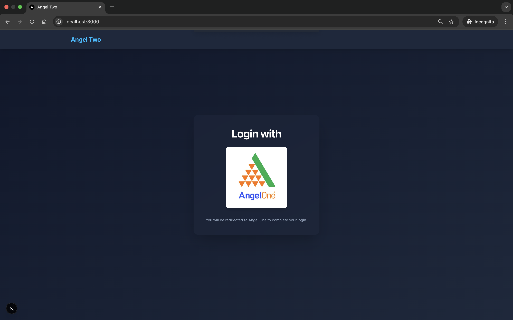
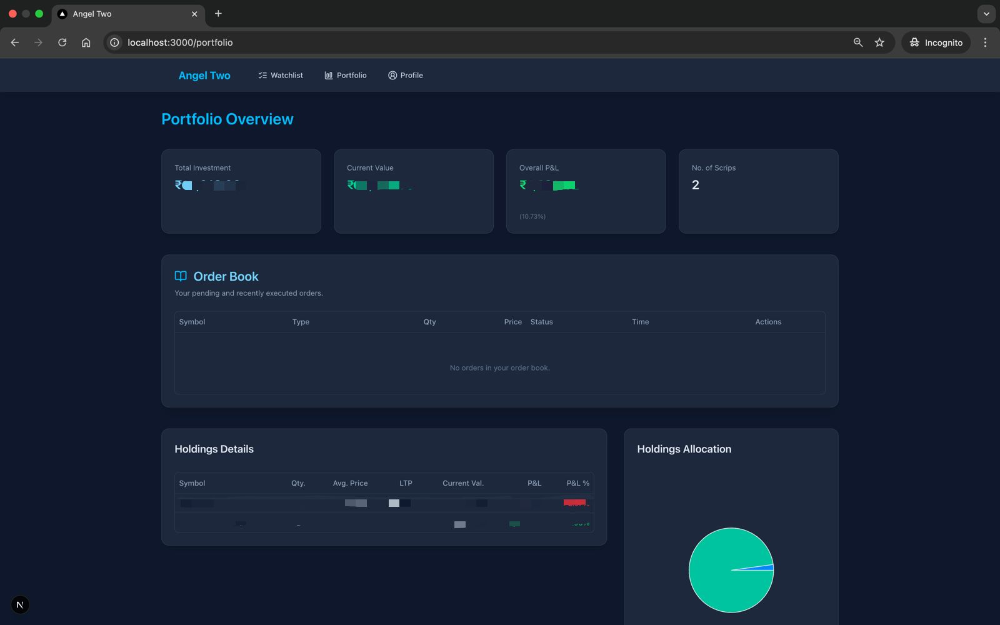
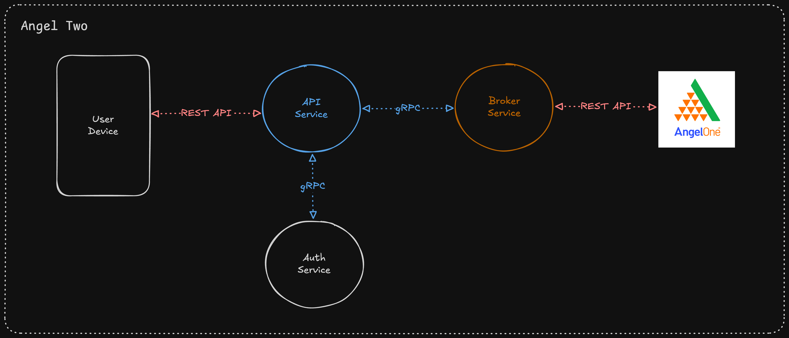
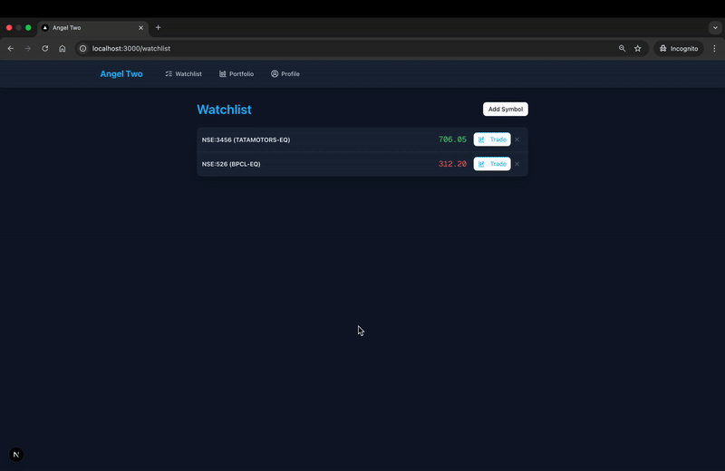

# Angel Two 🚀

**Angel Two** is a backend project built with Go (Golang) and gRPC, designed as a learning exercise to explore these technologies by interacting with the Angel One SmartAPI. It allows users to authenticate using their Angel One credentials and access various trading-related functionalities like placing orders, viewing holdings, and fetching market data.

This project was developed with a focus on understanding microservice architecture, efficient inter-service communication using gRPC, and the performance benefits of using a compiled language like Go for backend systems.

## ✨ Project Motivation & Key Learnings

*   **Learning Go & gRPC:** The primary goal was to gain hands-on experience with Golang for backend development and gRPC for high-performance, contract-first inter-service communication.
*   **Real-World API Integration:** Interacting with the Angel One SmartAPI provided a practical application for these technologies.
*   **Microservice Architecture:** The project is structured into distinct services (Auth, API Gateway, Broker) to simulate a microservices environment.
*   **Compiled Language Benefits:** Experienced firsthand the impressive speed and efficiency of Go. It's noticeably fast and resource-friendly!
*   **AI-Assisted Development:** Leveraged AI tools for learning, code generation assistance, and debugging, significantly accelerating the development and learning process.
*   **Session Management:** Implemented authentication flows involving external SSO (Angel One) and internal session management using JWTs and cookies.

## 🛠️ Tech Stack

*   **Backend:** Go (Golang)
*   **Frontend**: Next.js (with React, Tailwind CSS, Shadcn UI)
*   **Inter-Service Communication:** gRPC with Protocol Buffers
*   **API Gateway (HTTP Layer):** Go with Gin (for handling client HTTP requests)
*   **Database (Session Store):** In-memory store (for this learning project)
*   **Environment Management:** `.env` files (using `godotenv` library)
*   **Build/Task Management:** Makefile
*   **External API:** Angel One SmartAPI

## 🏛️ Architecture Overview

The project consists of three main backend services:

1.  **Auth Service (gRPC):**
    *   Handles initial authentication after Angel One SSO.
    *   Stores Angel One tokens securely (in-memory for this project).
    *   Generates and verifies internal `user_session_token` (JWT) used by the API Gateway.
    *   Provides RPCs for `Login` (token processing), `Verify` (session token validation), and `Logout` (session invalidation).

2.  **API Service (HTTP Gateway - Go/Gin):**
    *   Exposes RESTful HTTP endpoints to the client/browser.
    *   Handles incoming HTTP requests for login, logout, profile, orders, portfolio, and market data.
    *   Communicates with the Auth Service (via gRPC) for session validation and user token management.
    *   Communicates with the Broker Service (via gRPC) for trading-related operations.
    *   Manages the `user_session_token` cookie for the client.
    *   Includes middleware for authentication checks on protected routes.

3.  **Broker Service (gRPC):**
    *   Handles all interactions with the Angel One SmartAPI.
    *   Provides RPCs for:
        *   `GetProfile`
        *   `Logout` (from Angel One)
        *   `PlaceOrder`
        *   `CancelOrder`
        *   `GetHoldings`
        *   `GetLTP` (Live Traded Price)
        *   `GetFullQuote`
    *   Requires a valid Angel One JWT (obtained from the Auth service via the API service) and your Angel One API Key for its operations.

## 📋 Prerequisites

*   Go (version 1.18+ recommended)
*   Protocol Buffer Compiler (`protoc`)
*   `make` utility
*   An active Angel One account and an API Key from the [Angel One SmartAPI](https://smartapi.angelbroking.com/) platform.

## 📸 Screenshots & Demos

A quick look at some of the features and the system architecture. (All assets are located in the `/assets` directory of this repository).

**1. Login Page:**
   *Authenticates users via their existing Angel One credentials.*
   

**2. Portfolio Holdings Page:**
   *Displays the user's current stock holdings and their performance.*
   

**3. System Architecture:**
   *An overview of the microservice architecture and data flow.*
   

**4. Watchlist & Trading Demo:**
    *Add symbol to watchlist and place an BUY/SELL order..*
    

##  🔑 Handling Login Redirects to Localhost During Development(locally running only):
### Note: 
- When you configure your Angel One SmartAPI app, you need to provide a Redirect URL. After successful authentication, Angel One will redirect the user back to this URL with the necessary tokens (auth_token, feed_token, refresh_token) as query parameters.
- However, most OAuth/SSO providers (including Angel One for publisher login) do not allow redirecting directly to http://localhost URLs for security reasons. Here are two common ways to handle this during local development:

1.  **Using ngrok (Recommended for a smoother flow):**
    - *What it is:* ngrok is a tool that creates a secure tunnel from a public URL on the internet to your local machine. You get a temporary public URL (e.g., https://random-string.ngrok.io) that forwards traffic to your local development server (e.g., http://localhost:3000).
    - *How it solves the issue:*
        1. Start your Next.js frontend on http://localhost:3000.
        2. Run ngrok http 3000 in your terminal. ngrok will give you a public URL (e.g., https://abcdef12345.ngrok.io).
        3. In your Angel One SmartAPI app configuration, set your Redirect URL to your ngrok public URL followed by your callback path, e.g., https://abcdef12345.ngrok.io/angel1
        4. When you log in via Angel One, it will redirect to the ngrok URL, which then forwards the request (with tokens) to your local Next.js application running on port 3000.

2.  **Manual Token Transfer (Simpler setup, more manual steps):**
    - *How it works:* You'll use a placeholder redirect URL in your Angel One app configuration (one they accept, e.g., a non-existent HTTPS URL you own or a generic one if they allow it for testing). After Angel One authentication, your browser will be redirected to this placeholder URL. The URL will contain the tokens as query parameters. You'll then manually copy these tokens and provide them to your local application.
    - *Steps:*
        1. In your Angel One SmartAPI app configuration, set a placeholder Redirect URL (e.g., https://example.com/angel1).
        2. Click the login button in your local Next.js app (running on http://localhost:3000). This will take you to Angel One.
        3. Log in successfully on the Angel One platform.
        4. Angel One will redirect your browser to your placeholder URL, e.g., https://example.com/angel1?auth_token=xxx&feed_token=yyy&refresh_token=zzz.
        5. The browser will likely show an error because example.com/angel1 might not exist or isn't your app. This is expected.
        6. Important: Copy the URL `/angel1?auth_token=xxx&feed_token=yyy&refresh_token=zzz` from your browser's address bar.
        7. Paste it after your client(Next.js) running localhost server e.g., http://localhost:3000/angel1?auth_token=xxx&feed_token=yyy&refresh_token=zzz and enter, you will be logged in to `Angel Two`.


## ⚙️ Setup & Installation

1.  **Clone the Repository**

2.  **Environment Variables:**
    - Each service uses `.env` files for configuration. Create them in the respective service directories (`server/services/auth/`, `server/services/api/`, `server/services/broker/`). **Use these `.env.example`**
    - Keep all data same expect `ANGELONE_API_KEY` for quick setup.

3.  **Install Go Dependencies:**
    For each service:
    ```bash
    cd client && npm install && cd ..
    cd server/services/api && go mod tidy && cd ../../..
    cd server/services/auth && go mod tidy && cd ../../..
    cd server/services/broker && go mod tidy && cd ../../..
    ```

4.  **Generate gRPC Code:**
    From the `server/` directory (where your Makefile and `protobuf/` directory are assumed to be):
    ```bash
    make gen
    ```
    This will compile your `.proto` files and generate the necessary Go code.

## ▶️ Running the Application

The project uses a `Makefile` located in the `server/` directory to manage building and running services.

1.  **Run all backend services:**
    ```bash
    cd server/services/auth && go run . && cd ../../..
    cd server/services/broker && go run . && cd ../../..
    cd server/services/api && go run . && cd ../../..
    ```

2.  **Frontend:**
    Navigate to your frontend project directory and run its development server:
    ```bash
    cd client && npm run dev && cd ..
    ```
    Access the frontend at `http://localhost:3000` (or its configured port).

##  API Endpoints

*   **POST `/api/login`**: Initiates login. Client sends Angel One tokens; API service calls Auth service, sets `user_session_token` cookie.
    *   Body: `{ "jwt_token": "...", "feed_token": "...", "refresh_token": "..." }`
*   **POST `/api/logout`**: Logs the user out.
    *   Body: `{ "clientcode": "YOUR_CLIENT_CODE" }`
*   **GET `/api/profile`**: Fetches the user's Angel One profile. (Requires active session)
*   **POST `/api/orders/place`**: Places an order. (Requires active session)
    *   Body: (See Angel One `placeOrder` documentation for payload structure, matching `PlaceOrderRequest` proto)
*   **POST `/api/orders/cancel`**: Cancels an order. (Requires active session)
    *   Body: `{ "variety": "NORMAL", "orderid": "..." }`
*   **GET `/api/portfolio/holdings`**: Retrieves portfolio holdings. (Requires active session)
*   **POST `/api/market/ltp`**: Gets Last Traded Price for symbols. (Requires active session)
    *   Body: `{ "exchange_tokens": [{ "exchange": "NSE", "tokens": ["TOKEN1", "TOKEN2"] }] }`
*   **POST `/api/market/quote`**: Gets full quote data for symbols. (Requires active session)
    *   Body: `{ "exchange_tokens": [{ "exchange": "NSE", "tokens": ["TOKEN1", "TOKEN2"] }] }`

## 🙏 Acknowledgments

*   **Angel One SmartAPI Team:** For providing the comprehensive APIs that made this project possible.
*   The Go, gRPC, Gin, and Next.js communities for their excellent tools and documentation.
*   AI tools for their assistance in learning and development.

## 📄 License

This project is licensed under the MIT License. See the `LICENSE` file for details.